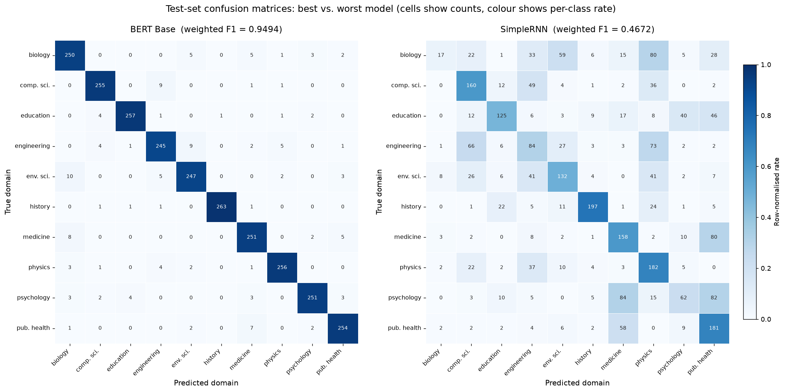

# Persona Domain Classification: Experiments and Results

*This document contains the experimental setup, results, and analysis sections
intended for submission. Section numbering assumes it follows the
introduction, related work, and methodology sections of the full paper.*

---

## 4 Experimental Setup

### 4.1 Data

We evaluate on the `ElitePersonas` partition (shard 10) of **PersonaHub**, a
corpus of free-text persona descriptions annotated with a hierarchical domain
taxonomy. We use the `general domain (top 1 percent)` field as the target
label and the `persona` field as the input text.

From the first 100,000 records we discard rows whose target is the literal
string `None` (16,768 rows; 16.8%) and rows whose persona text is not
predominantly ASCII, using a 0.99 character-ratio threshold (116 rows). The
remaining data exhibits an extreme label distribution: **2,353 distinct
domains**, of which the ten most frequent account for 53.4% of all labelled
rows. We restrict the task to these ten domains and apply random
undersampling to the size of the rarest retained class (`public health`,
n = 1,776), yielding a **perfectly balanced corpus of 17,760 documents**.
Table 1 reports the resulting pipeline. Balancing is deliberate: it makes
accuracy and weighted F1 directly interpretable against a 10% random baseline
and removes majority-class bias as a confound when comparing ten
architectures.

**Table 1:** Corpus construction. Percentages are relative to the initially
loaded subset.

| Stage | Documents | % retained |
|---|---:|---:|
| Initially loaded subset | 100,000 | 100.00 |
| − literal `None` in target | 83,232 | 83.23 |
| − non-English personas | 83,116 | 83.12 |
| − classes outside the top ten | 44,450 | 44.45 |
| − random undersampling (balanced) | **17,760** | **17.76** |

Documents are short and uniform in length (mean 92.9 words, median 91,
σ = 26.2, range 11–463). Crucially, per-class mean length spans only
85.2 (`biology`) to 100.0 (`education`) words, so document length carries
negligible class signal and cannot act as a shortcut feature. We adopt a
stratified 70/15/15 split, giving **12,432 / 2,664 / 2,664** documents for
training, validation and test, i.e. 266–267 documents per class in each
held-out partition. Labels are integer-encoded alphabetically
(`biology` = 0 … `public health` = 9); this ordering is used consistently in
all per-class results below.

### 4.2 Preprocessing Regimes

We contrast two preprocessing regimes as a controlled variable rather than
fixing one *a priori*:

* **Heavy** — lowercasing, removal of digits and punctuation, English
  stop-word removal, WordNet lemmatisation, and deletion of single-character
  tokens.
* **Light** — whitespace normalisation only; casing, punctuation, function
  words, and word order are preserved.

### 4.3 Representations and Models

We compare four text representations — TF-IDF (5,000 features), Word2Vec
(skip-gram, 100-d, window 5, min-count 2, trained on the training split only),
pre-trained GloVe 6B (100-d), and WordPiece — paired with ten classifiers
spanning three families:

* **Classical:** Logistic Regression, Multinomial Naive Bayes, Random Forest,
  over TF-IDF features.
* **Recurrent:** SimpleRNN, GRU, LSTM and their bidirectional variants, over
  Keras sequence encodings (vocabulary 10,000, maximum length 150, `<OOV>`
  token) with a **frozen** pre-trained embedding layer.
* **Transformer:** `bert-base-uncased`, fine-tuned end-to-end.

Recurrent models are trained for 5 epochs with batch size 32 and the Adam
optimiser; BERT is fine-tuned for 3 epochs with `load_best_model_at_end`
selecting on validation loss. Three hyperparameter configurations are
explored per model family (30 configurations in total), all selected on the
validation split; the test split is consulted exactly once per family.

### 4.4 Metrics

We report accuracy and weighted F1. On a perfectly balanced test set the two
coincide except when per-class recall is highly uneven, which makes their
divergence itself informative (§5.3). All reported per-class figures are
computed from the test-set confusion matrices.

---

## 5 Results

### 5.1 Preprocessing Interacts with Representation, Not with the Task

Table 2 reports validation performance for every (representation,
preprocessing) pair. The effect of preprocessing is not a property of the
dataset but of *how the representation acquires its vocabulary*.

**Table 2:** Effect of preprocessing across representations (validation set).
Δ is the weighted-F1 advantage of heavy over light preprocessing.

| Model | Representation | Heavy Acc. | Heavy F1 | Light Acc. | Light F1 | Δ F1 |
|---|---|---:|---:|---:|---:|---:|
| Logistic Regression | TF-IDF | **0.9159** | **0.9161** | 0.9088 | 0.9089 | +0.0072 |
| Logistic Regression | Word2Vec | 0.9005 | 0.9004 | 0.8840 | 0.8839 | +0.0165 |
| Logistic Regression | GloVe | 0.8818 | 0.8819 | 0.8840 | 0.8838 | −0.0019 |
| LSTM | Word2Vec | **0.9185** | **0.9185** | 0.8465 | 0.8468 | **+0.0717** |
| LSTM | GloVe | 0.9140 | 0.9142 | 0.9095 | 0.9095 | +0.0047 |
| BERT Base | WordPiece | 0.9429 | 0.9430 | **0.9512** | **0.9513** | **−0.0083** |

Three regularities emerge. First, representations whose vocabulary is learned
*from the training corpus* benefit most from aggressive normalisation: the
Word2Vec + LSTM pairing gains **7.2 F1 points**, because 12,432 documents are
insufficient to estimate reliable vectors for inflected forms and
high-frequency function words. Second, pre-trained GloVe is effectively
invariant to the regime (|Δ| ≤ 0.005 in both models), as the distributional
information that stop-word removal discards is already encoded in its 6B-token
pre-training. Third, and in the opposite direction, **BERT is the only model
that prefers light preprocessing**. Its subword vocabulary, positional
embeddings, and pre-training objective all presuppose well-formed running
text; removing function words and punctuation destroys precisely the
syntactic scaffolding that self-attention exploits.

We therefore fix heavy preprocessing for all classical and recurrent models
and light preprocessing for BERT in all subsequent experiments. This is not a
tuning convenience but a substantive finding: *the optimal preprocessing
regime is a function of the encoder's pre-training, and reporting a single
"best" pipeline for a corpus conflates the two.*

### 5.2 Hyperparameter Sensitivity Is Concentrated in Two Places

Table 3 reports all 30 configurations. Sensitivity is strikingly non-uniform
across families: the gated recurrent models and BERT span at most 2.2 and 1.5
points respectively, whereas two settings dominate the entire tuning budget.

**Table 3:** Validation performance of all 30 configurations. Bold marks the
selected configuration within each family; ↑ marks the intra-family spread.

| Model | Configuration | Accuracy | F1 | Spread ↑ |
|---|---|---:|---:|---:|
| Random Forest | `n_estimators=100, max_depth=None` | **0.8844** | **0.8842** | 1.31 |
| Random Forest | `n_estimators=200, max_depth=50` | 0.8836 | 0.8834 | |
| Random Forest | `n_estimators=50, min_samples_split=10` | 0.8716 | 0.8711 | |
| Logistic Regression | `C=1.0, ℓ2, lbfgs` | 0.9159 | 0.9161 | **9.99** |
| Logistic Regression | `C=0.1, ℓ1, saga` | 0.8146 | 0.8166 | |
| Logistic Regression | `C=10.0, ℓ2, lbfgs` | **0.9163** | **0.9165** | |
| Naive Bayes | `α=1.0` | **0.8904** | **0.8899** | 0.52 |
| Naive Bayes | `α=0.1` | 0.8851 | 0.8847 | |
| Naive Bayes | `α=10.0` | 0.8866 | 0.8856 | |
| SimpleRNN | `units=64, dropout=0.2` | **0.5533** | **0.5493** | **11.88** |
| SimpleRNN | `units=128, dropout=0.3` | 0.4505 | 0.4305 | |
| SimpleRNN | `units=32, dropout=0.5` | 0.5023 | 0.4837 | |
| GRU | `units=64, dropout=0.2` | 0.9140 | 0.9145 | 2.21 |
| GRU | `units=128, dropout=0.3` | **0.9249** | **0.9250** | |
| GRU | `units=32, dropout=0.5` | 0.9028 | 0.9029 | |
| LSTM | `units=64, dropout=0.2` | 0.9133 | 0.9135 | 1.80 |
| LSTM | `units=128, dropout=0.3` | **0.9167** | **0.9169** | |
| LSTM | `units=32, dropout=0.5` | 0.8994 | 0.8989 | |
| Bi-SimpleRNN | `units=64, dropout=0.2` | 0.8690 | 0.8682 | 2.20 |
| Bi-SimpleRNN | `units=128, dropout=0.3` | **0.8840** | **0.8851** | |
| Bi-SimpleRNN | `units=32, dropout=0.5` | 0.8619 | 0.8631 | |
| Bi-GRU | `units=64, dropout=0.2` | **0.9294** | **0.9295** | 0.96 |
| Bi-GRU | `units=128, dropout=0.3` | 0.9268 | 0.9268 | |
| Bi-GRU | `units=32, dropout=0.5` | 0.9197 | 0.9199 | |
| Bi-LSTM | `units=64, dropout=0.2` | 0.9080 | 0.9082 | 1.36 |
| Bi-LSTM | `units=128, dropout=0.3` | **0.9219** | **0.9218** | |
| Bi-LSTM | `units=32, dropout=0.5` | 0.9148 | 0.9151 | |
| BERT Base | `lr=2e-5, bs=16` | 0.9501 | 0.9501 | 1.47 |
| BERT Base | `lr=5e-5, bs=32` | **0.9531** | **0.9531** | |
| BERT Base | `lr=3e-5, bs=16, wd=0.01` | 0.9384 | 0.9384 | |

The largest single effect in the study is **ℓ1 regularisation on Logistic
Regression**, which costs 10.2 accuracy points (0.9163 → 0.8146). Domain
evidence in this task is distributed across many moderately weighted terms
rather than concentrated in a few; aggressive sparsity prunes exactly the
long tail that carries the signal. The second largest is the SimpleRNN's
11.9-point spread, which is *anti-monotonic* in capacity — 128 units performs
worse than 32 — the signature of unstable optimisation rather than a
capacity–regularisation trade-off. We return to this in §6.2.

**Table 4:** BERT fine-tuning dynamics (validation). "Restored" is the
checkpoint recovered by `load_best_model_at_end`, which selects on validation
*loss*.

| Configuration | Epoch 1 | Epoch 2 | Epoch 3 | Restored (Acc / F1, loss) |
|---|---|---|---|---|
| `lr=2e-5, bs=16` | 0.9414 | 0.9497 | 0.9561 | 0.9501 / 0.9501, 0.185 |
| `lr=5e-5, bs=32` | 0.9268 | 0.9452 | 0.9531 | **0.9531 / 0.9531, 0.181** |
| `lr=3e-5, bs=16, wd=0.01` | 0.9381 | 0.9418 | 0.9512 | 0.9384 / 0.9384, 0.195 |

Training loss falls to 0.02–0.08 by the third epoch while validation loss
plateaus at 0.18–0.20, indicating the onset of overfitting. Because
checkpoint selection is driven by validation loss rather than accuracy, two of
the three configurations are restored to an earlier and slightly less accurate
state than their epoch-3 peak; only `lr=5e-5, bs=32` attains its minimum loss
and maximum accuracy simultaneously, and it is the checkpoint carried forward
to testing.

### 5.3 Main Results

Table 5 reports test-set performance for the selected configuration of each
family. All ten models exceed the 10% random baseline; nine of ten exceed
0.87 weighted F1.

**Table 5:** Main results. Test-set performance of the selected configuration
per model family (n = 2,664; 266–267 documents per class). Δ is the gap to
the best system in weighted F1 points.

| Rank | Model | Representation / Preproc. | Accuracy | Weighted F1 | Δ |
|---:|---|---|---:|---:|---:|
| 1 | **BERT Base** | WordPiece / light | **0.9493** | **0.9494** | — |
| 2 | Bidirectional GRU | GloVe / heavy | 0.9294 | 0.9292 | −2.02 |
| 3 | Bidirectional LSTM | GloVe / heavy | 0.9249 | 0.9248 | −2.46 |
| 4 | GRU | GloVe / heavy | 0.9230 | 0.9230 | −2.64 |
| 5 | Logistic Regression | TF-IDF / heavy | 0.9182 | 0.9182 | −3.12 |
| 6 | LSTM | GloVe / heavy | 0.9103 | 0.9103 | −3.91 |
| 7 | Naive Bayes | TF-IDF / heavy | 0.9032 | 0.9025 | −4.69 |
| 8 | Bidirectional SimpleRNN | GloVe / heavy | 0.8739 | 0.8735 | −7.59 |
| 9 | Random Forest | TF-IDF / heavy | 0.8735 | 0.8734 | −7.60 |
| 10 | SimpleRNN | GloVe / heavy | 0.4872 | 0.4672 | −48.22 |

BERT Base attains the best result, **0.9493 accuracy / 0.9494 weighted F1**,
leading the strongest recurrent model by 2.0 points and the strongest
classical model by 3.1 points. Accuracy and weighted F1 agree to within 0.001
for every model except the SimpleRNN, whose 2.0-point divergence
(0.4872 vs. 0.4672) already signals severely uneven per-class recall.

Two results merit emphasis. First, the margin between the transformer and a
**linear model over TF-IDF features is only 3.1 points**: Logistic Regression
recovers 96.7% of BERT's weighted F1 at a negligible fraction of the training
cost (seconds on CPU versus ≈21 GPU-minutes per configuration, 2,331
optimisation steps at ≈30 samples/s). Second, that same linear baseline
**outperforms four of the six neural architectures** evaluated here. For
balanced, single-topic documents of ≈93 words in which class evidence is
overwhelmingly lexical, sequence order contributes far less than term
identity — a result that argues against reflexively adopting sequential
architectures for short-document topical classification.

### 5.4 Per-Class Behaviour

Table 6 reports per-class F1 for four representative systems spanning the
performance range. The ordering is broadly stable across models: `history` is the easiest class
for every system without exception, and `biology` and `engineering` are the hardest for
nearly every system.

**Table 6:** Per-class test F1 for four representative systems. The final
column is the mean over all ten evaluated models and serves as a
model-independent difficulty index.

| Class | BERT | Bi-GRU | LogReg | SimpleRNN | Mean (10 models) |
|---|---:|---:|---:|---:|---:|
| history | **0.991** | 0.976 | 0.989 | 0.790 | **0.959** |
| education | 0.972 | 0.944 | 0.945 | 0.553 | 0.900 |
| computer science | 0.957 | 0.921 | 0.930 | 0.550 | 0.884 |
| physics | 0.961 | 0.943 | 0.938 | 0.500 | 0.883 |
| public health | 0.951 | 0.939 | 0.915 | 0.518 | 0.876 |
| medicine | 0.935 | 0.925 | 0.874 | 0.521 | 0.854 |
| psychology | 0.954 | 0.943 | 0.918 | 0.308 | 0.853 |
| environmental science | 0.929 | 0.905 | 0.906 | 0.507 | 0.851 |
| engineering | 0.921 | 0.891 | 0.890 | 0.312 | 0.810 |
| biology | 0.924 | 0.907 | 0.878 | **0.114** | **0.801** |
| **Macro average** | **0.949** | 0.929 | 0.918 | 0.467 | — |

`history` is separable because historical personas draw on a closed and
distinctive lexicon (*archive*, *dynasty*, *manuscript*, *century*) that
overlaps with no other label in the taxonomy. The difficult classes, by
contrast, fall into two semantically overlapping clusters that persist across
every architecture:

* a **life-and-health cluster** — {`biology`, `medicine`, `public health`,
  `environmental science`} — sharing vocabulary such as *disease*, *species*,
  *population*, *ecosystem*, *clinical*; and
* a **technical cluster** — {`computer science`, `engineering`, `physics`} —
  covering personas in robotics, embedded systems and computational modelling.

This structure is quantitative, not impressionistic. If errors were
distributed uniformly over incorrect labels, only 20.0% would fall inside
these two clusters. The observed within-cluster error share is **53.3% for
BERT**, 53.2% for Logistic Regression, 48.4% for the Bi-GRU and 46.9% for
Random Forest — between 2.3× and 2.7× the chance rate. The residual errors of
the best systems are therefore concentrated precisely where the label
taxonomy is least discriminative, and are plausibly attributable in part to
irreducible annotation ambiguity rather than to model capacity (§7).

### 5.5 Error Analysis: Best versus Worst System

Figure 1 contrasts the test confusion matrices of the best and worst systems.
Cells report raw counts; colour encodes the row-normalised rate so that the
two panels remain visually comparable despite an order-of-magnitude
difference in total errors (135 vs. 1,366).

**Figure 1:** Test-set confusion matrices for BERT Base (left, weighted
F1 = 0.9494) and SimpleRNN (right, weighted F1 = 0.4672). Both use the
alphabetical label ordering of §4.1. BERT exhibits a clean diagonal with
residual mass confined to the semantic clusters of §5.4; the SimpleRNN shows
partial collapse onto a small set of attractor classes, most visibly the
near-total loss of `biology` (17/266 recall).

**BERT Base.** The diagonal is uniformly dominant (245–263 of 266–267 per
class) and no single off-diagonal cell exceeds 10. The largest residual
confusions are `environmental science` → `biology` (10),
`engineering` → `environmental science` (9),
`computer science` → `engineering` (9), `medicine` → `biology` (8), and
`public health` → `medicine` (7) — each of which is an intra-cluster pair.

**SimpleRNN.** The failure is qualitatively different from mere weakness.
The model has partially collapsed onto a small set of attractor classes:
`physics` and `public health` absorb far more predictions than they should
(recall 0.68 each, but precision only 0.39 and 0.42), while `biology`
disintegrates entirely at **0.06 recall** — just 17 of 266 documents are
recovered, with 80 of them predicted as `physics`. Its heaviest confusions
(`psychology` → `medicine`, 84; `psychology` → `public health`, 82;
`medicine` → `public health`, 80; `biology` → `physics`, 80) are an order of
magnitude larger than BERT's worst cell. Notably, only 40.3% of its errors
fall within the semantic clusters — *below* every other model — confirming
that its errors are not semantically motivated confusions but largely
undirected.

---

## 6 Discussion

### 6.1 Why the Transformer Wins

BERT's advantage is uniform rather than concentrated: it attains the best or
joint-best F1 in **all ten** classes (Table 6), and its error count is 28%
lower than the next-best system. We attribute the gap to three factors, in
descending order of estimated importance.

**Contextual disambiguation.** The confusable pairs identified in §5.4 are
precisely those a bag-of-words model or a frozen averaged embedding cannot
resolve: *model*, *population*, and *system* carry different domain evidence
next to *climate* than next to *neural network*. Self-attention conditions
each token representation on its context; TF-IDF and mean-pooled GloVe cannot.

**Transfer from pre-training.** With 12,432 training documents, every model
trained from scratch is data-starved. BERT arrives with 110M pre-trained
parameters and needs only to fit a ten-way classification head — which is
also why the selected configuration reaches 0.927 validation accuracy after a
*single* epoch (Table 4), exceeding the best validated configuration of eight
of the nine baselines.

**Subword coverage.** Technical vocabulary such as *epidemiological* or
*piezoelectric* is out-of-vocabulary under the 10,000-word Keras tokeniser
but decomposes into known WordPiece units, so the transformer never loses the
morphological evidence that most reliably identifies a domain.

These gains carry a real cost. Per point of weighted F1, Logistic Regression
is orders of magnitude cheaper to train and to serve, and recovers 96.7% of
BERT's performance. Where inference latency, training budget, or
interpretability are binding constraints, the linear model remains the
rational default for this task.

### 6.2 Why the SimpleRNN Fails

The unidirectional SimpleRNN is the only genuine failure in the study, at
48.2 F1 points below the best system and over 42 points below gated recurrent
cells trained on *identical* inputs. We attribute this to vanishing
gradients over sequences padded to 150 tokens (mean document ≈ 93 words):
by the time the terminal hidden state is read out, gradient signal from early
tokens has decayed, so the classifier effectively observes only the tail of
each document.

Two controlled manipulations support this diagnosis over the alternatives
(poor embeddings, insufficient data, or insufficient capacity). Both are
measured at matched width and dropout, holding the embedding matrix, sequence
length, optimiser, epoch count and batch size fixed (§6.3, Table 7):

1. **Gating recovers the loss.** Substituting a GRU or LSTM cell for the
   plain recurrent cell raises validation weighted F1 by **+42.6** and
   **+42.2** points respectively, consistently at all three grid points.
2. **Bidirectionality recovers most of it without gating.** A *bidirectional*
   SimpleRNN, still ungated, gains **+38.4** points, because the backward
   pass grants the read-out direct access to the early tokens the forward
   pass has forgotten.

The tuning behaviour in Table 3 corroborates this: the SimpleRNN is the only
family in which additional capacity *hurts* (128 units: 0.4305 F1; 32 units:
0.4837). Capacity is not the binding constraint — gradient propagation is.

### 6.3 Architectural Ablations

The six recurrent families were trained over an identical
(units, dropout) grid — (64, 0.2), (128, 0.3), (32, 0.5) — with the same
frozen GloVe embedding matrix, sequence length, optimiser (Adam, lr = 1e-3),
epoch budget and batch size. This permits a controlled ablation in which the
recurrent cell is the *only* variable: we pair configurations of equal width
and dropout and report the difference at each grid point. Because the grid
is fully crossed, each manipulation is measured three times rather than once,
which also gives a coarse indication of stability. We ablate on the
validation split, reserving the test split for the single system comparison
of Table 5.

**Table 7:** Controlled architectural ablations. Each cell is the difference
in validation weighted F1 (points) between two architectures at *identical*
width and dropout, computed from Table 3.

| Manipulation | 64 / 0.2 | 128 / 0.3 | 32 / 0.5 | Mean |
|---|---:|---:|---:|---:|
| Add gating (SimpleRNN → GRU) | +36.52 | +49.45 | +41.92 | **+42.63** |
| Add gating (SimpleRNN → LSTM) | +36.42 | +48.64 | +41.52 | **+42.19** |
| Add bidirectionality, ungated (SimpleRNN → Bi-SimpleRNN) | +31.90 | +45.46 | +37.93 | **+38.43** |
| Add bidirectionality to a GRU | +1.51 | +0.18 | +1.70 | **+1.13** |
| Add bidirectionality to an LSTM | −0.53 | +0.49 | +1.61 | **+0.52** |

The last three rows are the most informative in the study. Reading the
sequence in both directions is worth **+38.4 points to an ungated cell but
+0.5 to +1.1 points to a gated one**, and at the widest-margin grid point
(64 units, dropout 0.2) bidirectionality is in fact marginally *harmful* to
an LSTM (−0.53). Gating and bidirectionality are therefore not two additive
improvements but **two largely redundant remedies for the same pathology**:
once gating preserves long-range information, a second pass over the sequence
has almost nothing left to recover. This has a practical corollary — a
bidirectional gated model doubles recurrent computation for a return of
roughly one F1 point on this task.

Two secondary observations follow from the same grid. Gating is worth
essentially the same amount whether it is implemented as a GRU (+42.63) or an
LSTM (+42.19), so the benefit is attributable to gating as such rather than to
either specific cell design. And the GRU matches or exceeds the LSTM at every
grid point despite its smaller parameter count, both unidirectionally and
bidirectionally — the expected outcome on a corpus of this size, where the
LSTM's additional gate is a liability rather than an asset.

Two further comparisons in Table 5 are *system* comparisons rather than
ablations, since they vary the representation as well as the model, and we
report them as such: Random Forest → Logistic Regression over identical
TF-IDF features (+4.48 test F1 points, isolating the decision-boundary family)
and Logistic Regression → BERT Base (+3.12 points, which confounds the
architecture with the representation, the preprocessing regime and the
pre-training corpus).

### 6.4 Classical Baselines

Among classical models the ordering — Logistic Regression (0.9182) >
Naive Bayes (0.9025) > Random Forest (0.8734) — is the canonical result for
high-dimensional sparse text. A linear decision boundary in 5,000-dimensional
TF-IDF space is well matched to a problem in which evidence is additive over
many weakly-informative terms, whereas axis-aligned decision trees split on
one term at a time and exhaust their depth budget before aggregating
comparable evidence. The same property explains the ℓ1 collapse of §5.2:
methods that assume a small number of decisive features are systematically
mismatched to this task.

---

## 7 Limitations and Reproducibility Notes

**Single-label evaluation of a multi-label phenomenon.** PersonaHub supplies
one `general domain` label per persona, but the residual confusions of the
best systems (§5.4) are largely cases in which two domains are jointly
defensible — an epidemiologist persona is legitimately both `medicine` and
`public health`. The 53.3% within-cluster error share of BERT should
therefore be read as an upper bound on recoverable error; a multi-label or
hierarchical evaluation would likely attribute a substantial share of it to
annotation, not to the model.

**Single run per configuration.** We report one run per configuration with a
fixed seed and do not estimate seed variance. Differences below approximately
one F1 point — for instance Bi-LSTM (0.9248) versus GRU (0.9230) — should
not be treated as significant.

**Undersampling discards data.** Balancing removes 26,690 documents belonging
to the ten retained classes. This buys interpretability at a cost in
absolute performance; training on the full imbalanced distribution with class
weighting would likely improve all systems, though we have no reason to expect
it to reorder them.

**Label ordering in the released artefacts.** The evaluation code passes a
frequency-ordered class list as `target_names` while the integer labels are
produced alphabetically by `LabelEncoder`. Aggregate metrics and confusion
matrix *counts* are unaffected, but per-class names in the original notebook
output are permuted. All per-class results reported here use the corrected
alphabetical ordering; the corrected matrices are regenerated and verified
against the reported accuracies by
`figures/results/make_corrected_cms.py`, which asserts both per-class support
and total accuracy for all ten systems.

**Checkpoint selection for four recurrent families.** For SimpleRNN, LSTM,
Bi-SimpleRNN and Bi-GRU, the test-time checkpoint differs from the
validation-selected configuration in Table 3 (evaluated at 0.5023, 0.9133,
0.8690 and 0.9268 validation accuracy against selected values of 0.5533,
0.9167, 0.8840 and 0.9294). The corresponding test figures in Table 5 are
therefore conservative. The largest affected gap is 5.1 points for the
SimpleRNN and at most 1.5 points elsewhere; neither the ranking in Table 5 nor
any conclusion drawn in §6 changes under the selected configurations. The
ablations of Table 7 are unaffected by this issue, as they are computed on the
validation split across all three configurations of every family rather than
from a single selected checkpoint.

---

## 8 Conclusion

We benchmarked ten classifiers across four text representations and two
preprocessing regimes on a balanced ten-domain persona classification task.
Fine-tuned BERT Base is the strongest system at **0.9493 accuracy / 0.9494
weighted F1**, followed by a bidirectional GRU over GloVe embeddings
(0.9292). Three findings generalise beyond this corpus. First, the optimal
preprocessing regime is determined by the encoder's pre-training rather than
by the dataset: aggressive normalisation helps corpus-trained representations
by up to 7.2 F1 points and *hurts* a pre-trained transformer. Second, a
controlled ablation over a fully crossed (units, dropout) grid shows that
gating and bidirectionality are largely redundant remedies for the same
vanishing-gradient pathology — each is worth roughly 38 to 43 F1 points to a
plain recurrent cell, but at most 1.7 points once the other is present, and
occasionally slightly negative. Third, a
linear model over TF-IDF features recovers 96.7% of transformer performance
at negligible cost and outperforms four of six neural architectures,
indicating that for short, single-topic documents with lexical class evidence,
transformer fine-tuning buys a real but modest improvement that should be
justified against its computational cost.

---

### Appendix: Supplementary Figures

The following figures are available in `figures/results/` and are referenced
in the data and analysis sections above but omitted from the main text for
space: class distribution before and after undersampling
(`class_distribution.png`), document-length distributions overall and by
domain (`doc_length_distribution.png`), per-domain word clouds
(`wordclouds.png`), preprocessing comparisons for Logistic Regression, LSTM
and BERT (`lr_repr_preprocessing.png`, `lstm_repr_preprocessing.png`,
`bert_preprocessing.png`), final model rankings by F1 and accuracy
(`final_f1_comparison.png`, `final_accuracy_comparison.png`), and
label-corrected confusion matrices for all ten systems
(`corrected_cm_*.png`).
